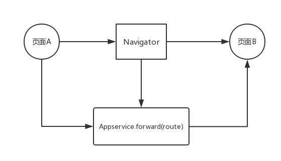
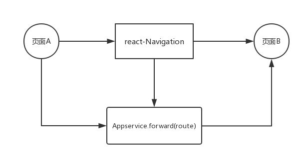

## 前言

前段时间，完成了公司项目的底层代码重构，主要内容是采用新的导航器---**react-navigation**，来取代之前用的react官方提供的页面导航器**Navigator**。重构期间，不是很顺利，踩了不少坑，毕竟是底层的代码，所以重构起来非常谨慎，怕影响到上层的业务逻辑。大部分的重构都是由我一个人负责完成，做了不少笔记，刚好我的个人博客撘好了，那就在这里总结一下重构过程吧。

## Question：为什么要重构？

首先，重构不是老大要求的，而是我提出来的并得到允许才进行的。为什么我要提出要抛弃Navigator？有几点：

> * react-native官方提供的页面导航器组件Navigator性能非常不好，这点官方也承认了，在react-native**0.44**版本之后已经删掉了这个组件，并推荐使用第三方组件**react-navigation**。
> * 在我用Navigator实际项目开发中，就感觉到了它的不友好，性能非常差。特别是开启Chrome远程调试的时候，在页面跳转中会导致整个程序的卡死，崩溃，所以我只能用Android Studio来看debug，然而Android Studio查看JSON数据很是蛋疼，不能像Chrome那样可以格式化JSON，所以非常影响我的开发效率。
> * react-navigation就是为了解决这个问题而生的，据称性能非常接近原生，我写了几个demo发现确实解决了我之前遇到的问题。
> * 既然官方已经宣布不再维护Navigator，如果项目在往后要升级react-native版本，那就必须放弃Navigator这个组件。

## 重构前的准备

大家都知道，想要重构底层的代码，就首先要把项目结构弄得非常熟悉，尽量不要影响上层的业务代码，不然bug多得修到你想吐=。=

（本来想用七牛云图床来展示分析导图的，但是注册七牛云要绑定域名，域名购买还是审核实名制，总之今天是用不了图床的了orz...）
算了，就用文字 + 代码来说说吧...

  

之前的项目整个页面跳转都是通过Navigator来维护的，所有的页面跳转和通讯通过AppService类提供的静态方法进行，再细点页面跳转和数据传递都是使用`AppService.forward`这个方法实现。其中，
`AppService.forward(Route)`，这个方法会接收`Route`对象，这个对象的结构是`{name:'',dest:'',param:{}}`,`name`是获取的数据的接口名,`dest`是页面名,`param`是传递的参数。

    页面A--(to)--->Navigator[AppService.forward(Route)]--(to)--->页面B

## 开始重构

弄清了项目的设计结构，就要开始着手替换`Navigator`的计划了。首先，我要做到的就是要用最小的成本来实现组件的替换。当前项目的页面结构分为多个模块，每个模块下又具分为多个子页面，都是`模块名_页面具名.js`。在`app.js`,也就是根文件下，会全局注册模块页面，然后通过`AppService.forward(页面具名)`来进行跳转，这就是Navigator的实现方式。我只有**用react-navigation实现页面跳转的方法和Navigator实现方法一致**，才能最大程度的减少项目的重构成本，毕竟在外层的代码有太多太多是用到`Appservice.forward(Route)`这个方法了。

### 关于页面跳转的实现

`react-navigation`提供的页面跳转方法只要是通过`StackNavigator`这个api来实现的:<br>

`StackNavigator(RouteConfigs, StackNavigatorConfig)`<br>
**下面只给出demo**

    const Navs = StackNavigator({
        页面名:{screen: (页面.js)},
        页面名:{screen: (页面.js)},
        页面名:{screen: (页面.js)},
        ...
    },{
        编写基本配置...
        如跳转动画选择，
        导航栏显示方式，
        还有页面回调等等
    })

    跳转就是使用
    this.props.navigation.navigate('页面名',{参数})来实现



我在`app.js`里面全局注册StackNavigator, 并改写了一个`function`来格式化装有**页面名.js**对象的数据格式，让这个对象的数据结构为`{页面名:{screen: (页面名.js)},...}`(这是`react-navigation`规定的)，初始化页面默认为**start.js(登录页)**。

```javascript
// 格式化成{wd.home:{screen:wd.home}}
function initPages(pages) {
	// pages是一个包含所有项目页面引用的对象
	const allPages = {};
	let obj = {};
	for(let key in pages){
		obj = {screen: pages[key]};
		allPages[`${key}`] = obj
	}
	return allPages
}

const screenPages = initPages(AppService.pages);

const Navs = StackNavigator(
    {
	start:{screen:start},
	...screenPages
    }, 
    ...
)
```

### 关于页面数据传递的实现

完成了页面跳转，接下来就要实现页面之间的数据了。

在使用Navigator的时候，数据都存放在`Route.param`对象里面，然后在跳转目标页面里面通过`this.props.route.param`来获取传来的数据。

在react-navigation中，数据是通过props.navigation.navigate这个api来进行传递的，比如：

    页面A--->this.props.navigation.navigate('页面B'，{参数})--->页面B

    在页面B内可以通过this.props.navigation.state.params来接收参数

现在，我就按照这种思路，重写了`AppService.forward()`这个函数，还有在`BasePage.js（ps:用于页面继承的类）`也做了大量修改。页面的跳转和数据传递，还是通过`AppService.forward(Route)`这种形式来传，`Route`对象的数据结构保持不变，一切的逻辑都在底层的AppService这个类里面进行重写和改造，分点实现是这样的:

> * props.route 替换为 props.navigation.state.params
> * this.props.route.param替换为this.props.navigation.state.params.param

现在，在页面B是通过`this.props.navigation.state.params.param`来获取参数，这样，基本实现了从最底层无缝地用react-navigation替换掉Navigator。

### 关于数据请求接口name字段的处理

在页面跳转过程中，如果`Appservice.forward(Route)`中`Route`里面有`name`字段，跳转的目标页面会根据这个接口`name`来请求数据，所以，我在AppService类中同样做了处理,基本是这样的:

```JavaScript
// 优先处理name字段
const param = {};
Route.name ? param加入name字段 : param加入dest和param字段
AppService.forward('页面名',param);

// 注意，这里AppService.forward已经被我封装好了，相当于
AppService.forward == this.props.navigation.navigate
```

当然，具体的代码还是有很多业务逻辑判断来进行处理的，加上额外的组件有一些方法也需要进行重写，上面只是简单地说明了name的处理方法。

## 总结

在公司的新项目中，这套react-natvigation方案已经开始使用，解决了chrome调试崩溃的问题，大大提高了开发效率。说真的，项目重构学到的知识还是很多的，比如，重构的过程中，我对react的使用有了更深的了解，在项目重构前，我做了不少关于react-navigation的demo，查阅了有关react-navigation的[文档](https://reactnavigation.org/docs/intro/)，还有[博客](http://blog.csdn.net/sinat_17775997/article/details/70176688)。对react-navigation的使用也越加熟悉。其实重构要做的不仅仅上面说的这些，还是有些耦合度有点高的组件，得一个个解耦，只有真正做到最大程度组件间的解耦，才能更好地维护项目代码。如何去降低代码之间的耦合度，也是一个非常值得探索的方向。


