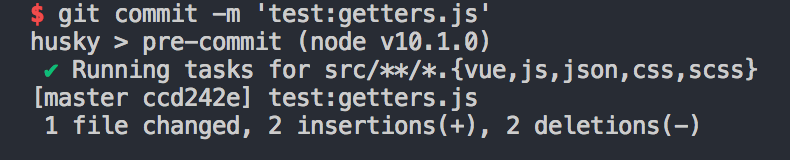
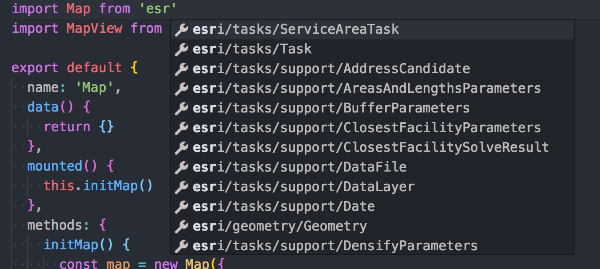
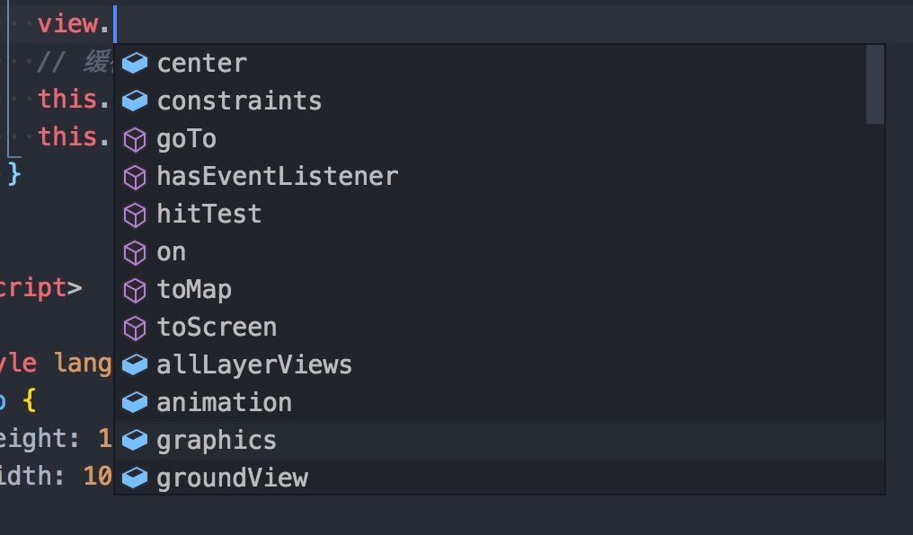

## 前言

三个月前，我在公司内部进行了一次关于[arcgis+webpck 实现前端工程化](https://github.com/shooterRao/Arcgis-webpack-PPT)的技术分享。在那次分享中，我分别简单举例了关于`react+webpack+arcgis`、`vue+webpack+arcgis`、`ts+dojo+webpack+arcgis`这几个方案的[实现](https://github.com/shooterRao/arcgis-webpack-demo)，其中对[vue+webpack+arcgis](https://github.com/shooterRao/arcgis-webpack-vue)这一方案进行比较多的讲解，但那时候的`vue-arcgis-demo`是直接用**webpack4.8.3**从零开始构建的，并没有在`vuecli2`生成的项目基础上进行修改，在配置方面还是存在许多**不足**。后来我仔细研究了 vuecli2 生成项目的 webpack 配置，搞明白之后就直接改配置并成功接入 arcgis 框架了，下面总结一下这个过程。

<!--more-->

## 已实现的功能

在 vuecli2 生成项目的基础上，经过修改 webpack 配置和引入一些模块实现了以下几个功能：

- 修改 webpack 配置支持使用 arcgis 框架，支持`import Map from 'esri/Map'`写法
- 修改`html-webpack-plugin`配置，支持动态`require`注入带**Hash**后缀的 js 和 css 文件
- 增加外部配置文件，支持动态加载 arcgis 框架或其它工具库
- 引入`@types/arcgis-js-api`，`@types/dojo`，`tsd.d.ts`，提供 arcgis 框架及 dojo 框架相关 api 语法提示
- 引入 vuex，方便在 Map 组件实例已挂载情况下，其它组件可以通过`this.map`方法来获取地图实例对象
- 引入 eslint(airbnb)、prettier
- 引入 githook(pre-commit)，git

## 方案选择

### esri-loader

`esri-loader`是在 esri 公司工作老外写的一个加载器。我看到在公司一些弱 gis 的项目中有用到，也就是用`esri-loader`把 arcgis 里的相关模块给加载出来，下面是官方文档的例子：

```js
esriLoader
  .loadModules(["esri/views/MapView", "esri/WebMap"])
  .then(([MapView, WebMap]) => {
    const webmap = new WebMap({
      portalItem: {
        id: "f2e9b762544945f390ca4ac3671cfa72"
      }
    });
    const view = new MapView({
      map: webmap,
      container: "viewDiv"
    });
  })
  .catch(err => {
    console.error(err);
  });
```

从代码上看，esriLoader 实际上返回的是一个`Promise`实例，里面包装这相关的模块。后来我看了下这个 esriLoader 的源码，实际上它是通过动态创建`<script>`标签加载 arcgis 框架，然后再去通过`require(['mduleA', 'moduleB'])`去加载相关模块，最后`Promise.resolve([])`出来。

这种方案虽然是可以解决加载地图的问题，但是如果把这种方案放在强 gis 项目上，那意味着所有 arcgis 相关模块都强依赖于`esriLoader.loadModules`，地图相关操作的方法都不太好进行抽象和管理，完全耦合在每个组件里面了，也不方便进行拓展。还有个问题，由于`arcgis js api`的`init.js`很大，如果在网络不好的情况下，初次挂载地图组件可能会出现等待时间比较久的问题。

但是，如果是弱 gis 方面的项目，不需要进行太多地图相关的操作，使用 esriloader 是一种不错的方案，因为使用它完全不需要修改 vuecli 的相关配置，可以直接采用 webpack 默认的加载器，使用起来几乎没什么成本。

### 改 webpack 配置

其实，做这种接入适配最难搞的是如何让 webpack 接入 arcgis 框架。首先 arcgis js api 依赖 dojo1，dojo1 用的是`require.js`AMD 模块加载器(dojo2 已经重构，不再依赖 require.js，但是最新的 arcgis 仍然用 dojo1)，所以 arcgis 框架内部也是基于 AMD 模块方式编写的，webpack 也是模块打包器，只不过比`require.js`强大得多，思想更加先进，功能也更加丰富。webpack 默认打包出来的模块不是 AMD 模块，所以导致打包出来的模块和 arcgis 框架的 AMD 模块天然不和，也就不能直接地使用`import Map from 'esri/Map`这类的写法。虽然 arcgis 模块无法被打包成 webpack 可以认识的模块，但是反过来，强大的 webpack 可以把模块打包成 AMD 模块，让 arcgis 框架识别并加载出来，所以问题就解决了。

下面，是每个步骤的详细介绍：

- 首先，第一步，如上文说的，让 webpack 帮我们打包模块为 AMD 模块。这里，我们可以直接在`vue/build/webpack.base.conf.js`文件中，webpack 的 output 配置中加多一行代码：

```js
module.exports = {
  output: {
    libraryTarget: "amd" // 解决amd模块问题
  }
};
```

- 既然让 webpack 把所有模块都打包成 AMD 模块了，那么 webpack 在处理`import Map from 'esri/Map'`这块代码时，仍然会报错。为什么？因为项目和`node_modules`中没有`esri`这个模块，`esri`的模块是通过`require.js`进行加载的。所以解决方法是添加 webpack 配置，让 webpack 在处理类似`import Map from 'esri/Map'`这种`esri`、`dojo`开头的模块，不作处理，直接放回`Map`，统一用`require.js`进行加载。具体方法如下：

依旧在`vue/build/webpack.base.conf.js`文件中，添加如下配置：

```js
module.exports = {
  // 末尾添加即可 (其实顺序不重要)
  externals: [
    // 当遇到引入包含dojo/esri/dgp等模块时，不处理
    function(context, request, callback) {
      if (
        /^dojo/.test(request) ||
        /^dojox/.test(request) ||
        /^dijit/.test(request) ||
        /^esri/.test(request)
      ) {
        return callback(null, "amd " + request);
      }
      callback();
    }
  ]
};
```

- 剩下要解决的是`html-webpack-plugin`插件动态注入资源的问题了。在开发环境和生成环境中，vuecli2 是默认开启让`html-webpack-plugin`插件动态注入资源到`index.html`模块上的，所谓的资源，主要就是 webpack 构建完成后的 js 和 css。默认的注入方式是构建`script`标签进行 src 引入。因为 webpack 打包后的模块都是`define(xxx, function())`这种形式的 AMD 模块，通过`script`标签引入浏览器是识别不了的，所以必须得用`require(xxx)`方法进行加载。为了解决这个问题，我在`vue/build/webpack.dev.conf.js`和`vue/build/webpack.prod.conf.js`文件中找到`html-webpack-plugin`插件的相关配置，发现它的默认配置项不多，`dev`和`prod`的配置区别也就是路径和是否压缩，可参考的选项并不多。所以我只好去`html-webpack-plugin`插件的[github 文档](https://github.com/ampedandwired/html-webpack-plugin)上查询是否有我想要的 api，更改动态输出 js 的方法。经过一番查阅，发现只能通过引入自定义的 html 模板，再添加`loadsh`模板语法进行动态注入资源。

  1.首先，统一在`html-webpack-plugin`的配置对象中添加`inject: false`

```js
new HtmlWebpackPlugin({
  filename: "index.html",
  template: "index.html",
  inject: false // 不进行自动注入，改为模板注入
});
```

2.在根目录下的`index.html`下进行添加模板语法，分别处理打包好的 css 和 js

```html
<head>
...
<!-- 动态注入app.hash.css等 -->
<% for(const cssChunk of htmlWebpackPlugin.files.css) {%>
  <link rel="stylesheet" href="<%= cssChunk %>"/>
<% } %>
<head/>>

<script>
  var chunks = [];
  `<% for (const jsChunk of htmlWebpackPlugin.files.js) { %>`
    chunks.push("<%= jsChunk %>");
  `<% } %>`
  // 通过require加载打包好的模块(manifest.hash.js,、vendor.hash.js、app.hash.js...)
  require(chunks)
</script>
```

**注意：在生产环境中，这些 chunk 都是带有 Hash 值的，高效利用浏览器缓存机制**

3.完成以上步骤之后，最重要的是，在加载业务模块之前，必须先加载 arcgis 框架。方法有 2 种，一是直接在`index.html`模板里面添加，二是继续利用`html-webpack-plugin`把框架引入进来。我个人认为第二种方式更为优雅，也方便开发的小伙伴在不同个人环境中修改配置项，所以用了第二种方法：

先在根目录下创建`appConfig.js`，添加以下内容：

```js
module.exports = {
  htmlOpts: {
    title: "vuecli2-arcgis-base",
    libs: {
      arcgisJsApi: {
        js: "http://localhost:8080/arcgis4.7/init.js",
        css: "http://localhost:8080/arcgis4.7/esri/css/main.css"
      }
      // 这里可以继续添加各种库jq，lodash...
    }
  }
};
```

再在`index.html`模板中进行引入：

```html
<head>
<!-- 动态注入自定义css -->
<% for(const i of Object.keys(htmlWebpackPlugin.options.libs)) {%>
<% const lib = htmlWebpackPlugin.options.libs[i]%>
<% if(!!lib.css) { %>
<link rel='stylesheet' href='<%= lib.css %>'/>
<% } %>
<% } %>
</head>

<!-- 最开头引入lib -->
<% for(const i of Object.keys(htmlWebpackPlugin.options.libs)) {%>
<% const lib = htmlWebpackPlugin.options.libs[i]%>
<% if(!!lib.js) { %>
<script src="<%= lib.js %>"></script>
<% } %>
<% } %>
```

这样差不多就完成了，不过，我觉得可以封装下相关配置，在`vue/build/webpack.dev.conf.js`里面加入：

```js
// 配置配置文件合并HtmlWebpackPlugin选项
const htmlOpts = require("../appConfig.js").htmlOpts;
// 默认配置
const htmlDevOpts = {
  filename: "index.html",
  template: "index.html",
  inject: false,
  chunks: "all"
};
// 合并配置
const HtmlWebpackPluginOpts = Object.assign({}, htmlDevOpts, htmlOpts);
// 在plugin中改为
new HtmlWebpackPlugin(HtmlWebpackPluginOpts);
```

在`vue/build/webpack.prod.conf.js`里面，加入差不多的配置

```js
// 配置配置文件合并HtmlWebpackPlugin选项
const htmlOpts = require("../appConfig.js").htmlOpts;
// 默认配置
const htmlDefaultProdOpts = {
  filename: config.build.index,
  template: "index.prod.html",
  inject: false,
  minify: {
    removeComments: true,
    collapseWhitespace: true,
    removeAttributeQuotes: true
  },
  chunksSortMode: "dependency",
  chunks: "all"
};
// 合并配置
const HtmlWebpackPluginOpts = Object.assign({}, htmlDefaultProdOpts, htmlOpts);

new HtmlWebpackPlugin(HtmlWebpackPluginOpts);
```

**注意：在根目录中添加 index.prod.html 文件，区别于开发环境**

最后，可以分别尝试用`yarn dev`，`yarn build`进行测试下，如果步骤 ✅ 的话，项目是可以正常运行的。

## vuex 的作用

在一些弱 gis 项目中，我看到大部分是采用`EventBus`这种方式进行跨组件的事件传播。事件少的情况倒没什么，只要注意**多次挂载的组件必须在 destroy 声明周期中解除绑定的事件**即可。但是对于强 gis 项目，地图`Map`实例对象是很多组件会频繁用到的，如果大量使用`EventBus`进行`Map`对象传递和事件分发，这样维护起来非常困难。所以，引入`vuex`进行`Map`对象缓存和全局状态管理是种不错的方法，`vuex`其实相当于组件可共享的全局变量，但是不会直接暴露在`window`全局变量上。

我们可以简单写个 map 的 store：

```js
const map = {
  state: {
    map: null,
    mapView: null
  },
  actions: {
    setMap({ commit }, value) {
      commit("SET_MAP", value);
    },
    setMapView({ commit }, value) {
      commit("SET_MAPVIEW", value);
    }
  },
  mutations: {
    SET_MAP(state, value) {
      state.map = value;
    },
    SET_MAPVIEW(state, value) {
      state.mapView = value;
    }
  }
};
```

**map 的 store 最好通过以 module 的形式进行注册**

在 Map 组件实例化后，`map`和`mapView`对象会缓存在 vuex 中，在所有组件中都可以通过`const { map, mapView } = this.$store.state.map`这种方式进行取到对应的值

但是这种方法还不算方便，我们可以通过`vuex`提供的`getter`方法进行取`map`和`mapView`对象，创建`getters.js`：

```js
export default {
  map: state => state.map.map,
  mapView: state => state.map.mapView
};
```

然后在`new Vuex.Store({ getters })`注册 getters

接着，在其它组件中，加入：

```js
import { mapGetters } from "vuex";

export default {
  computed: {
    ...mapGetters(["map", "mapView"]) // 在函数中通过this.map、this.mapVie就可以获取相关对象了
  }
};
```

**mapGetters 这类对象可以统一用`Mixins: []`方式进行挂载**

## Eslint 和 Prettier

在我接手维护广州项目的时候，发现里面的项目代码是没有规范的，代码风格迥异，注释较少，所以在加需求和改 bug 的时候就非常痛苦了，最担心的是，一不小心改错了地方然后导致影响了其它功能，强耦合的代码很容易引发链式 bug 反应 🙈。对于没有注释的代码，想要读懂里面的逻辑往往要在里面进行 debugger，有时还要去猜。更让人难受的是，有一些模块功能很多，所以代码量大，一个 js 最多达到 3000+甚至 4000+行，也没有对模块进行业务和功能函数的拆分。其实这些的根本原因就是前期开发，没有约定好代码规范用工具来进行强制约束，导致后面越来越多坑，也就越来越难维护。

想要解决这个问题，最好的方法是前期就必须要引入`Eslint`来制订代码规范，使用`prettier`来统一代码风格。虽然没适应`Eslint`的童鞋会感到很难受，因为会出现很多编译不通过的问题，我开始也一样，但这些都是小问题，只需要按造`Eslint`制定好的规范进行对应的代码修改，长期下来，你会发现`Eslint`不仅能帮你避免编写低级错误的代码，还能提升团队的代码质量，更容易阅读。

`prettier`是一个代码格式化工具，我很早就已经开始使用了。这是一款非常非常给力的工具，它运用自身的规则将你的的代码重新格式化，不管你之前的代码风格是怎样的，总之你写完，再用一下这个工具，代码“刷”一下就变了。

在团队合作的项目中，在制定相关规范时，应采取**少数服从多数**规则进行制定，我这套模板主要是用了[airbnb](https://github.com/airbnb/javascript)的代码规范。

官方文档：

[Eslint](https://eslint.org/)

[Prettier](https://prettier.io/)

## Githook

有时候好不容易写完业务代码了，好累，测试也 ok，好，直接提交吧，然后没有提交完后发现**忘了用`prettier`进行代码格式化了！！**所以，`Githook`可以为我们解决这种情况的发生(Githook，顾名思义，也是就 git 的钩子，在对应的功能中会分别触发)。我这边用`husky`和`lint-staged`实现`pre-commit`钩子管理。也就是在`commit`代码前，强制使用`Eslint`和`prettier`进行代码规范约束和格式化。

安装好模块，在`package.json`中，只需要添加下面的信息：

```js
{
  "lint-staged": {
    "src/**/*.{vue,js}": [
      "prettier --write",
      "eslint --fix --ext",
      "git add"
    ],
    "src/**/*.{json,md,css,scss}": [
      "prettier --write",
      "git add"
    ]
  },
  "husky": {
    "hooks": {
      "pre-commit": "lint-staged"
    }
  }
}
```

如果提交在 src 目录下的`.vue,.js`文件先进行`prettier`进行代码格式化，再进行`eslint`的自动修复，最后 add && commit，如图：



## Arcgis 框架 api 语法提示

想`Vue`、`React`这些热门的框架，是拥有非常多的 vscode 语法提示插件的，而`Dojo`和`Arcgis`都是偏冷门的框架，我没有找到相关的 api 提示插件。后来我 google 了下发现，可以通过安装`@types/arcgis-js-api`，`@types/dojo`这 2 个模块，然后创建一个`tsd.d.ts`拓展来告诉 vscode：

```js
/// <reference path="./node_modules/@types/arcgis-js-api/index.d.ts" />
/// <reference path="./node_modules/@types/dojo/index.d.ts" />js
```

效果：



api 提示：



## 写在最后

其实这算是对三个月前技术分享的一些补充，修改一些 bug 的同时也加入了比较多的功能。Vuecli 是搭建前端开发环境的最佳实践，所以继续沿用这套实践方案也是比较好的选择。最近**Vuecli3**也发布 release 版了，webpack 的配置没有像 Vuecli2 那样全部暴露出来，而是封装成插件的形式进行加载，对不需要怎么更改 webpack 配置的开发者来说是非常友好的，但是对于像我们这种需要改比较多 webpack 配置的项目来说，是需要一些学习成本的，如果想更改 webpack 的配置，只能通过`webpack.chain`插件去修改了。目前还没仔细学习这个插件，所以还需要点时间，以后搞出来了再分享吧(๑•̀ ㅂ•́)و✧，Vuecli3 非常强大，我觉得只要习惯了 Vuecli3，就回不去 Vuecli2 了，这就是所谓的前端就是要紧跟潮流吧，哈哈 😀

国际惯例，附上[github 地址](https://github.com/shooterRao/arcgis-webpack-vue/tree/vuecli2)
