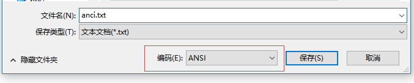
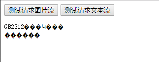
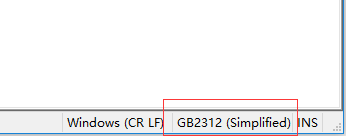
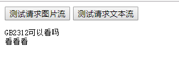

## 前言

前两天做项目的时候，碰到了一个要在客户端(浏览器)中实现预览 txt 文档和图片的小需求，在开发过程中遇到了一些有趣的小插曲---客户端读取 txt 时出现各种奇怪乱码，图片就没问题。一时半会还没找到好的解决方法，因为那天又刚好周五，所以在周末的时候，我决定宅在家里好好研究如何解决这个有趣的现象。

<!--more-->

## 先用 Koa2 搭建后台环境,并返回流

由于公司用的是基于 java 的后台环境，我电脑上没有搭好这些 java 框架的环境，于是我就用 Koa2(基于 Node.js 的一个框架)搭建好后台环境，先实现给客户端返回流。

### 如何搭建 Koa2 环境？

搭建 koa2 非常简单，先在一个新目录下，用`npm init --y`快递初始化`package.json`，然后用`npm`或者`yarn`装好 koa 的包

> npm install koa --save 或者 yarn add koa

新建一个`app.js`，在里面敲下

```javascript
const Koa = require("koa");
const app = new Koa();

app.listen(3000, () => {
  console.log(`Server is listening at 3000`);
});
```

接着你只需要用`node app`命令就可以在 3000 端口上启动一个服务器啦~

### 如何用 Koa2 返回流？

比如，我希望是这样的，客户端请求`http://localhost:3000/img?imgName=图片名.jpg`这个 url 时，会返回图片的流，用`http://localhost:3000/text?fileName=文档名.txt`这个 url 时，会返回文本的流。那么，该如何实现呢？来，上代码讲解

先安装`koa-router`

> npm install koa-router --save

#### 先实现图片流返回

```javascript
//引入koa-router包
const router = require("koa-router")();
// 引入fs文件系统
const fs = require("fs");

// 先实现返回图片流(buffer)
router.get("/img", async (ctx, next) => {
  let { imgName } = ctx.request.query; // 提取参数
  const res = await readImg(imgName);
  // res 为 Buffer流
  if (res) {
    ctx.type = "jpg";
    ctx.body = res;
  }
  await next();
});

// 用fs处理流
function readImg(filePath) {
  // 创建可读流
  let data = [];
  return new Promise((res, rej) => {
    const readerStream = fs.createReadStream(`./public/${filePath}`);
    readerStream.on("data", function(chunk) {
      data.push(chunk);
    });

    readerStream.on("end", function() {
      const finalData = Buffer.concat(data); // 合并Buffer
      res(finalData);
    });
  });
}
```

如果对上面代码有疑惑，建议先学习`ES7`的`async await`语法，再去读读 Koa2 的官方文档，有关`async await`的知识我到时会写一篇博客来讲解。

> 关于`async await`的学习可以[点这里](http://es6.ruanyifeng.com/#docs/async)

> Koa2 官网文档[点这里](https://koa.bootcss.com/)

#### 再来实现文档流返回

```javascript
router.get("/text", async (ctx, next) => {
  let { fileName } = ctx.request.query; // 提取参数
  const res = await readTXT(fileName);
  if (res) {
    ctx.type = "text";
    ctx.body = res;
  }
  await next();
});

function readTXT(filePath) {
  // 创建可读流
  let data = [];
  return new Promise((res, rej) => {
    const readerStream = fs.createReadStream(`./public/${filePath}`);
    readerStream.on("data", function(chunk) {
      data.push(chunk);
    });
    // 读完后promise返回
    readerStream.on("end", function() {
      const finalData = Buffer.concat(data);
      res(finalData);
    });

    readerStream.on("error", function(err) {
      rej(err);
    });
  });
}
```

接着，重要的不要忘处理跨域，应该客户端是在其他端口打开的

```javascript
// 处理跨域
router.all("/*", async (ctx, next) => {
  // *代表允许来自所有域名请求
  ctx.set("Access-Control-Allow-Origin", "*");
  // 其他一些设置...
  await next();
});

// use router
app.use(router.routes());

// 最后启动服务器
app.listen(3000, () => {
  console.log(`Server is listening at 3000`);
});
```

于是后端环境就搭建好了，下面来说说客户端怎么写测试

### 客户端写个测试测测

核心代码

```javascript
// 简单封装ajax
function ajax(url) {
  return new Promise((resolve, reject) => {
    const xhr = new XMLHttpRequest();
    xhr.open("GET", url, true);
    xhr.responseType = "blob";
    xhr.onload = () => {
      if (xhr.readyState == 4) {
        if (xhr.status == 200) {
          const blob = xhr.response;
          resolve(blob);
        } else {
          reject(xhr.statusText);
        }
      }
    };
  });
}

// get请求添加查询参数
function urlParam(url, name, value) {
  url += url.indexOf("?") == -1 ? "?" : "&";
  url += encodeURIComponent(name) + "=" + encodeURIComponent(value);
  return url;
}

// 点击获取图片，并渲染到页面上
reqImg.addEventListener("click", () => {
  const url = urlParam("http://localhost:3000/img", "imgName", "duang.jpg");
  ajax(url).then(response => {
    const blob = response;
    const img = document.createElement("img");
    img.src = window.URL.createObjectURL(blob);
    document.body.appendChild(img);
  });
});

// 点击获取txt,并渲染
reqTxt.addEventListener("click", () => {
  const url = urlParam("http://localhost:3000/text", "fileName", "utf8.txt");
  ajax(url).then(response => {
    const data = response;
    const reader = new FileReader();
    reader.readAsText(data);
    reader.onload = function() {
      const pre = document.createElement("pre");
      pre.innerText = this.result;
      document.body.appendChild(pre);
    };
  });
});
```

好了，测试看看


恩，到这就已经实现服务端可以返回流，客户端请求并渲染了。

## 说说遇到的小插曲（重点）

在前天开发的时候，后端给我传回了文本流，我这边也拿到了，不过在渲染时出现了很多乱七八糟的码，看得我头皮发麻。。。然后经过沟通发现，发现客户上传的 txt 不是`utf-8`编码的，是`ANSI`这种编码格式。接着，后端大佬问我能不能在客户端通过 js 来渲染`ANSI`格式的 txt 文档，因为后台转码可以会带来性能的一些问题。为了能解决这个问题，经过我周末的仔细研究和反复测试，发现问题不算很复杂，主要涉及到了一些关于编码方面的知识。

### 开始研究

首先，我试着保存一个`ANSI`编码的 txt 文本



然后通过服务端返回流，看看客户端会不会出现乱码
服务端代码不改，只改了客户端请求的文件，文件名为`ANSI`格式的 txt

结果



果不奇然，跟前天一样，乱码！出了一堆 ��� 的玩意！

怎么才能把这些神奇的字符翻译过来呢，于是，我就想有什么 api 可以，经过我一番查找，发现`FileReader的api readAsText(data, encoding)`第二个参数貌似可以翻译过来！突然有点小鸡冻，二话不说，赶紧试了下

```javascript
reader.readAsText(data, "ANSI");
```

刷新浏览器，点了下测试 button，结果...


还是一样啊！！！难道`readAsText`不支持`ANSI`这种编码格式吗？？？


### ANSI 是什么？

我在想，`ANSI`到底是一种什么样的编码，为什么不能转，于是通过搜索引擎去查查看，发现

> 不同的国家和地区制定了不同的标准，由此产生了 GB2312、GBK、Big5、Shift_JIS 等各自的编码标准。这些使用 1 至 4 个字节来代表一个字符的各种汉字延伸编码方式，称为 ANSI 编码。在简体中文 Windows 操作系统中，ANSI 编码代表 GBK(GB2312) 编码；在日文 Windows 操作系统中，ANSI 编码代表 Shift_JIS 编码。

这么说，`ANSI`只是一种假象？？？

接着 google 继续找


看完了一圈下来，我终于明白了，原来根本就没有**ANSI**这种编码！只是一种泛型！在不同的 Windows 版本里，`ANSI`是`gbk`或者`gb2312`编码，在日文中，为`Shift_JIS`编码，在繁体中文中，为`big5`编码。

于是，我用`nodepad++`打开`anci.txt`发现



果然是**gb2312**编码！！！**所以，用 UTF-8(网页默认)去读 gb2312 编码文档是会出现乱码情况的**。

so，换个角度，我是不是通过这么修改达到我的目的呢？

```javascript
reader.readAsText(data, "gb2312");
```

感觉是可以的，突然又有了一点小鸡冻！！！试试看~

duang~



结果能正常显示了！！！Yeah~

## 结论

> 事实上，所谓的「ANSI」指的是对应当前系统 locale 的遗留（legacy）编码。不要用记事本，用专业的文本编辑器保存为不带 BOM 的 UTF-8。(知乎大 V)

记得有位前辈说过，文档最好不要用记事本保存，用 nodepad++最好，以免出现无法预测的错误。到了今天我才知道，原来，那位前辈说的话恰好印证了上面某知乎大 V 说的，尽量不要用记事本保存。但是，毕竟客户不是搞开发的，他们也不知道这样编码的玩意，他们百分之 99.999%都是用记事本打开保存文档，然后上传，所以，在以后开发中，若是再出现这种情况，应该跟后端沟通好，如果是 gb2312 编码格式的 txt，就返回字段告诉前端，用`reader.readAsText(data, "gb2312")`去读写文档，避免出现乱码的尴尬现象。

最后附上 demo 的 github 地址: https://github.com/shooterRao/node-demo/tree/master/koa2-stream
