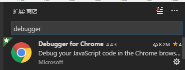
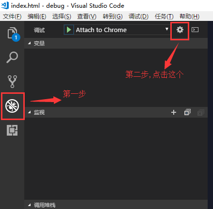
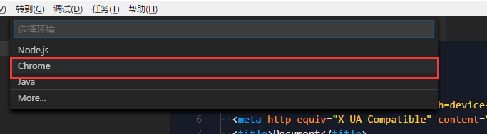
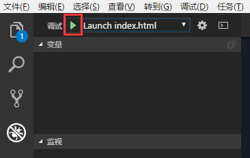
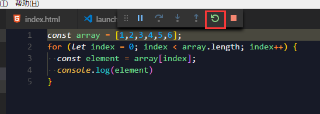
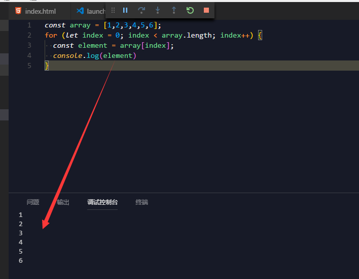
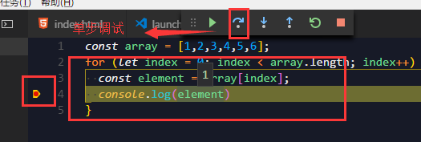
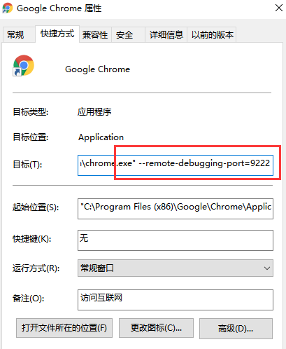
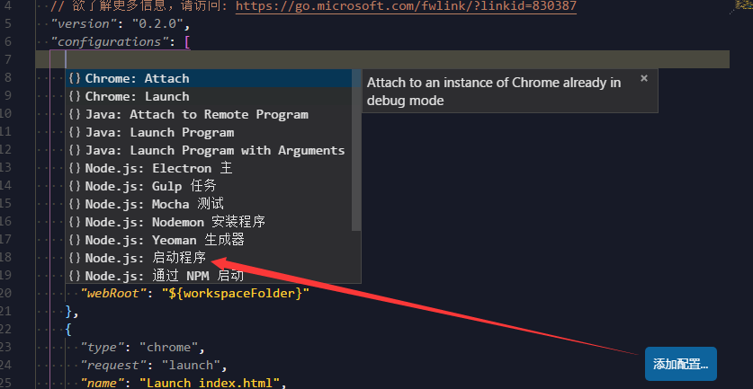

## 前言
一直觉得Vscode是前端开发最友好的IDE，里面内置的功能非常好用，无论是其拥有丰富的插件拓展，还是git的集成，都是提高效率的好帮手。Vscode还隐藏了一个据说非常强大的debugger模块，今天经过我一番尝试，发现十分有用，接下来，我就总结下如何使用Debugger模块进行代码调试。

## 你想在哪调试？😏

首先，这个标题起得确实有点那个，在哪调试？当然是在Vscode里面啊😓不过，这个“哪”，其实问的是环境。什么环境？就目前大前端来说，环境不过于分为浏览器(Chrome)和Node了。Chrome和Node虽然都能跑js，但是具体的环境是视它们版本而定的，所以，不能有我在Chrome下跑的js正常，在Node就一定正常这种说法，具体要看它们用的V8是不是同一版本的。

好了，不唠叨了，vscode的debugger环境是分为Chrome和Node的。接下来，我先讲讲如何在Chrome环境下，使用vscode debugger进行代码调试。

### Debugger For Chrome

Vscode里面是没有内置调试Chrome的模块的，需要单独安装。

第一步，先安装插件`Debugger For Chrome`



第二步，任意目录下创建一个名`debug`文件夹，接着在里面分别创建`index.html`，`index.js`文件.

第三步，配置这个插件，让它跑起来：

首先，先打开vscode调试区域，然后点设置



然后，选Chrome



进入了`launch.json`文件

把配置改成

```JavaScript
  "version": "0.2.0",
  "configurations": [
    {
      "type": "chrome",
      "request": "launch",
      "name": "Launch index.html",
      "sourceMaps": true,
      "file": "${workspaceRoot}/index.html"
    },
  ]
}
```
最后，切成`Launch index.html`，再点绿色icon或者在`index.html`目录下直接按`F5`就跑起来啦



快看看你的chrome是不是自动启动了！

如果启动了，ok，接着在`index.html`下引入`index.js`，在`index.js`里面随便写点js，然后重新启动



看，`console.log()`不是在vscode里面显示出来啦



#### 断点调试

我们试试在vscode里面加断点，单步调试



OK，完全没问题，感觉是不是很方便，调试js只需要在IDE中完成，**不用再切换到浏览器中了！**

#### 有点高级的用法(加Attach)

抛出一个问题，加Attach有什么用？

我在平常开发中，是结合`live-server`(vscode插件)进行开发的，`live-server`非常强大好用，它会监听你文件改动进行自动刷新浏览器，无须手动去刷新。这里`Attach`的作用就是去附加在我用`live-server`启动的开发的服务器上，去监听我那里的`chrome debugger`，通俗来讲，就是让vscode的调试控制台上可以完整得显示出`debugger`信息。

举个栗子吧，我用`live-server`开了个`http://localhost:5500`的服务，里面有很多`console.log`和`debugger`信息，如果我不加`Attach`，只能在chrome的`F12`调出devtools看信息和动态打断点调试。有了`Attach`，调试js时，我就不用老是盯着浏览器的devtools去看了，也不用去找文件打断点了，直接在vscode里面完成所有调试，真爽😝

如何配置使用？

首先用`live-server`打开`index.html`，你会发现浏览器自动跳转到`http://localhost:5500`上了。好，接着到`launch.json`进行配置

```javascript
{
    "type": "chrome",
    "request": "attach",
    "name": "Attach to Chrome",
    "port": 9222,
    "webRoot": "${workspaceFolder}"
},
{
    "type": "chrome",
    "request": "launch",
    "name": "启动 Chrome 并打开 localhost",
    "url": "http://localhost:5500",
    "webRoot": "${workspaceFolder}"
},
```
配到这里，如果你直接试着直接去开启，发现是不行的，我刚开始尝试时掉进这个坑里，后来，在官方配置文档里找到了答案，需要对Chrome浏览器启动项进行配置



关掉你现在的chrome，在去vscode调试面板上，换成`Attach to Chrome`，在启动，就可以了~😆

那么，让所有关于js调试都在Vscode里面搞定吧！

### 调试Node.js

Vscode内置Node的调试环境，就不需要安装插件了，先创个名为`node.js`的文件，然后在`launch.json`里添加配置



```JavaScript
{
    "type": "node",
    "request": "launch",
    "name": "Launch Node",
    "program": "${workspaceFolder}/node.js"
}
```

配置完成后，在调试面板上，启动选项切换成`Launch Node`，然后启动就可以了，断点调试什么都是没问题的。

Tips：
> 我觉得如果是学习JavaScript的话，写demo配合Vscode里的Node的调试环境是不错的选择。

用Vscode的Debugger对用框架(react,vue,ng)编写的网页调试也是非常方便的，方法也都差不多，这里不一一举例了，有兴趣的童鞋可以自行尝试😁

## 总结

上面就是总结了，这里没啥写了，附上参考文档的链接吧

[Debugger For Chrome](https://github.com/Microsoft/vscode-chrome-debug)

[参考视频](https://www.bilibili.com/video/av14868402/)

