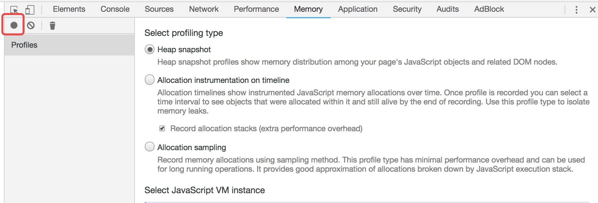
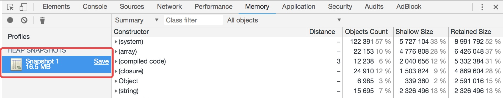
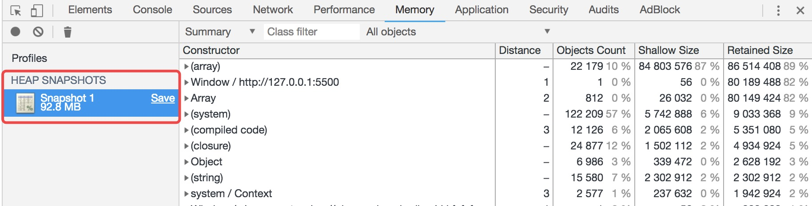
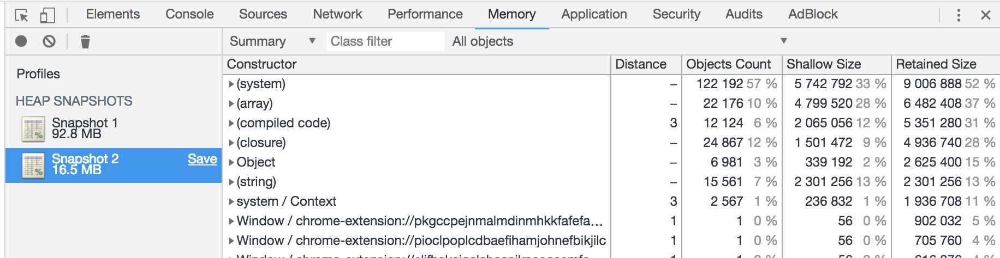
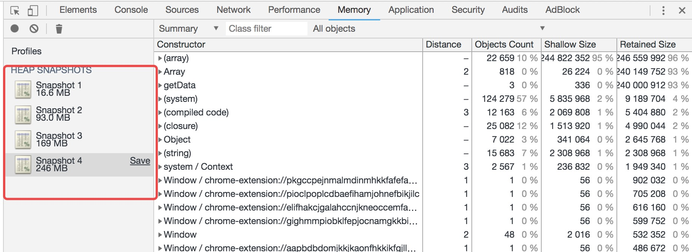
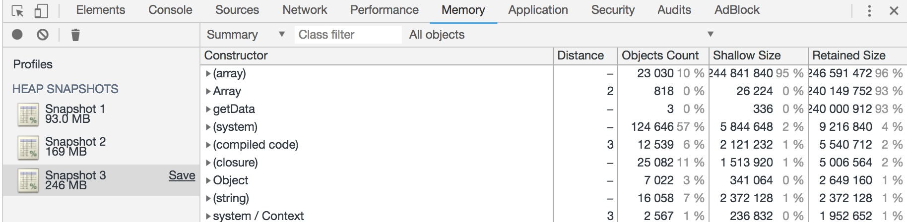
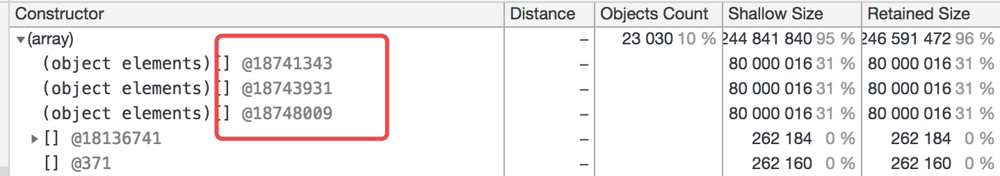
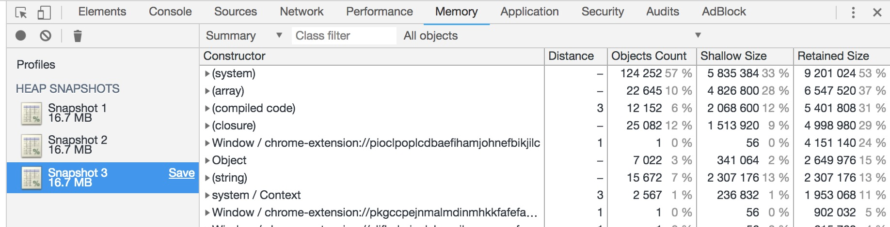

## 前言

在上周，有位前端小伙伴开发完某个功能进行测试的时候，在执行某个方法(获取数据)后，突然发现电脑内存会飙升，而且是每执行一次方法，内存就会递增一次，我看到后的第一反应就觉得是内存泄漏了。因为之前我没也遇到过这种情况，所以成功引起了我的兴趣，便试着去一探究竟。通过一番研究，问题终究水落石出，也学到了不少新知识，接下来我们一起慢慢聊。

## 什么是“js内存泄漏”？

抛开案例，先来说说什么是内存泄漏。首先，js和c/c++语言不同，js属于动态语言，她具有自动垃圾收集机制，执行环境会负责管理代码执行过程中使用的内存，无须像c/c++那样手工跟踪内存使用情况。我们在编写程序时，new了一次对象相当于申请了一块堆内存，一般情况下局部变量和对象使用完就会被js引擎自动回收，但是在闭包情况下，还有保持着对这个对象**引用**的话，js引擎是不会对其进行回收的，应为js引擎会认为它还有存在的意义😑...所以这种情况下，我们只有通过我们手动去让引擎进行回收。如果这个对象存在真的是有意义的，那就没问题，如果说只用一次就不要了，但是这个对象一直在内存里面没有被释放就发生了所谓的---内存泄露。

举一个栗子🌰:
```javascript
window.onload = function() {
  // 回调函数其实是一个闭包
  var array = null;
  array = new Array(1000000);
  var array2 = array;// array引用+1
  // 对大数据一系列分析...
  // 好了，我现在不需要这个大物了
  // 但是它依旧存在内存中
}
```

像上面栗子的情况下，我猜想`Array(1000000)`是不会被js引擎回收的，因为闭包内还存在对这货的引用。

> 为了证明我的猜想，我们用chrome的devtools里的Memory来验证一下

首先把上面一段代码放到一个空白干净的html页面上，直接执行，然后打开chrome开发者工具，找到Memory的Tab页，然后直接点图中那个点，拍一张内存快照。



你会看到快照上显示具体的内存占用大小


不要惊讶，`new Array(1000000)`占了一大半体积，我用`Array(1000000)`这个大物是为了能更加直接看出大小。事实证明确实没有被引擎回收。

接下来，我们加几句代码试试

```javascript
window.onload = function() {
  // 回调函数其实是一个闭包
  var array = null;
  array = new Array(1000000);
  var array2 = array;
  array = null;
  array2 = null;// 切记array2也需要置为null
}
```

现在对array和array2都进行了"null处理"，让它们彻底对大物`Array(1000000)`进行解绑，我们拍个内存看看



果然，在把array和array2置为`null`后，内存占用大大减少，`Array(1000000)`成功被回收✌️

还有一种情况，如果把array当成全局变量，然后在闭包内对其进行赋值，不把它置为null也是无法被回收的，
举个🌰:

```javascript
var array = null;// 在script标签内的最外层，相当于全局变量
window.onload = function() {
  array = new Array(1000000);
}
```

继续拍张照片，发现内存依旧占用很高



于是，我们继续用老套路

```javascript
var array = null;
window.onload = function() {
  array = new Array(1000000);
  array = null;
}
```

拍张照片，你会看到内存被回收了。



> （高程3）中有这么一段话-----确保占用最少的内存可以让页面获得更好的性能。优化内存占用的最佳方式，就是为执行中的代码只保存必要的数据。一旦数据不再有用，最好通过将其置null来释放其引用，这个方法叫做解除引用。这一做法适用于大多数的全局变量和全局对象属性。局部变量会在它们离开执行环境时自动被解除引用。

## 回顾真实案例，思考解决办法🤔

前面聊了比较多有关内存泄漏方面的知识，现在该来回顾回顾上周遇到的案例了。

### 案例描述

同事写了个搜索方法，通过按钮点击然后去调服务进行查询，然后返回一堆很大很大量的数据(这也是我为什么前面要用大物来模拟的原因)，因为返回数据量很大，所以占用内存高也是必须的。但是开始令我们感到困惑的是，每点击一次搜索，内存占比都会递增一次，上次搜索的结果没有被系统回收，导致了内存泄漏，这么一来，如果点多几次搜索，电脑内存小的话页面估计会奔溃。接下来，我用精简版代码来还原一下当时的情况。

```javascript
function GetData() {
  this.data = [];// 其实这里清空没什么用......
  this.data = new Array(10000000);// Array()模拟获取的大数据
}
window.onload = function() {
  var btn = document.getElementById('btn');
  btn.addEventListener('click', () => {
    var obj = new GetData();// 获取数据......
    console.log(obj);// 对obj引用+1
  })
}
```

大概就是上面那样。每点击一次按钮，就会生成一个GetData的实例，这个实例包含了获取回来的数据。我们先点3次按钮，然后拍一张照片，看看神马情况~



太恐怖了😱，内存占用果然在递增！！


别慌，小场面~

### 解决方案

好，我们有置null大法在，用起来~~

```javascript
function GetData() {
  this.data = [];// 其实这里清空没什么用......
  this.data = new Array(10000000);// Array()模拟获取的大数据
}
window.onload = function() {
  var btn = document.getElementById('btn');
  btn.addEventListener('click', () => {
    var obj = new GetData();// 获取数据......
    console.log(obj);// 对obj引用+1
    obj = null;// 置null
  })
}
```

看来可以了，我们测试看看，点3下，拍张照



wtf，置null大法失效了！！内存依旧没变，占用一直是递增！！

淡定一下，


我们来看看置null为什么会失效。首先，我们在点击3次按钮后的快照进行分析



我们可以看到，点击了三次，new出了三个大物，这三个大物都没有被回收，所以肯定是null用错了地方，注意下，我们造出大物的地方在构造函数`GetData`里面，如果我们直接把obj置为null的话，认真想想好像是没啥意义的，它在哪(作用域)造出来，我们就要在哪(作用域)把它置null

所以，我试着把代码改改

```javascript
function GetData() {
  this.data = [];// 其实这里清空没什么用......
  this.data = new Array(10000000);// Array()模拟获取的大数据
  // 加多一个清空数据的方法
  this.emptyData = function() {
    this.data = null;// 手动触发垃圾回收
  }
}

window.onload = function() {
  var btn = document.getElementById('btn');
  btn.addEventListener('click', () => {
    var obj = new GetData();// 获取数据......
    console.log(obj);// 对obj引用+1
    // 数据处理好了，再见吧大物
    obj.emptyData();
  })
}
```

好，我们继续测试，点3个拍个照！



搞定啦，大物终于被系统给gg了！

## 总结

其实，关于内存泄漏方面的知识远不止这些，还有事件绑定未解绑，没有销毁函数等等也会引发内存泄漏，导致系统变慢。这次案例只是涉及到闭包内部变量引发的内存泄漏问题。也许将来还会遇到更多奇妙的，意想不到的问题，其实我觉得将来遇到的每个问题，都是提升能力的机会，不要方不要害怕不要急，慢慢去探究，总会有新发现的。毕竟，吃胖也是需要时间的。。。。。。好了，不鸡汤了，半夜了，该睡觉💤了。

参考资料
感谢
[内容泄漏分析](https://juejin.im/post/5b2fd09ee51d45588576f429)


